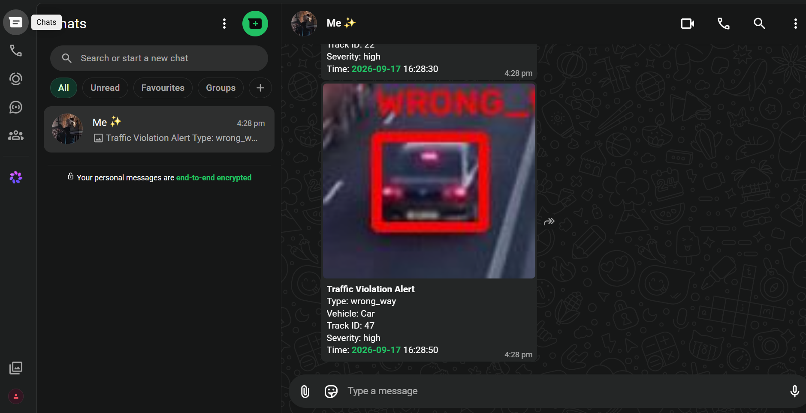

# 🚦 Edge-AI Traffic Analytics Engine

### Vehicle Flow Counting • Traffic Intelligence • Violation Detection • Edge AI

<p align="center">
  <strong>A working traffic-camera analytics engine for real-time vehicle detection, tracking, multi-lane flow analysis, speed estimation, traffic-violation detection, telemetry, and operational monitoring.</strong>
</p>

<p align="center">
  
  
  
  
  
  
</p>

---

## 📸 Live System Preview

### 🖥️ Live Traffic Operations Console

The live operations dashboard brings together vehicle detection, tracking IDs, traffic counts, lane activity, violation monitoring, and incident logs in one interface.

<p align="center">
  
</p>

### 📱 Automated Traffic Violation Alert

Critical violations can trigger structured WhatsApp alerts containing the violation type, vehicle information, track ID, severity, timestamp, and supporting evidence.

<p align="center">
  
</p>

---

## 🎯 What This Project Does

This project turns a traffic-camera feed into an intelligent traffic-monitoring pipeline.

```text
Traffic Camera / Video
        │
        ▼
┌──────────────────────┐
│  YOLO Vehicle        │
│  Detection           │
└──────────┬───────────┘
           ▼
┌──────────────────────┐
│  Multi-Object        │
│  Tracking / IDs      │
└──────────┬───────────┘
           ▼
┌──────────────────────┐
│  Lane + Direction    │
│  Analysis             │
└──────────┬───────────┘
           ▼
┌──────────────────────┐
│  Speed Estimation    │
└──────────┬───────────┘
           ▼
┌──────────────────────┐
│  Violation Detection │
│  • Wrong-way         │
│  • Red-light         │
│  • Lane cut-in       │
└──────────┬───────────┘
           ▼
┌──────────────────────┐
│ FastAPI + WebSocket  │
│ Dashboard + MQTT     │
└──────────┬───────────┘
           ▼
┌──────────────────────┐
│ Evidence + Alerts    │
│ CSV + WhatsApp       │
└──────────────────────┘
```

The system is designed to run on a development machine for testing and can be adapted for **Raspberry Pi 4/5 (64-bit)** and **NVIDIA Jetson-class edge hardware**.

---

## ✨ Key Capabilities

| Capability | Description |
|---|---|
| 🚗 Vehicle Detection | YOLOv8n / COCO-pretrained detection for cars, trucks, buses, and motorcycles |
| 🎯 Multi-Object Tracking | Stable vehicle IDs using Ultralytics ByteTrack |
| 🛣️ Multi-Lane Counting | Directional inbound/outbound counting using tripwire line crossing |
| ↔️ Direction Analysis | Vehicle movement and lane-direction analysis |
| ⚡ Speed Estimation | Distance/time estimation between calibrated lines |
| 🚨 Wrong-Way Detection | Detect vehicles moving against configured lane direction |
| 🚦 Red-Light Detection | Signal-state-driven red-light violation logic |
| ↪️ Illegal Lane Cut-In | Detect suspicious lane transitions |
| 📸 Evidence Capture | Save violation snapshots with timestamps and available speed data |
| 📡 MQTT Telemetry | Publish metrics, violations, and online/offline status |
| ⚙️ FastAPI | REST, WebSocket, and MJPEG endpoints |
| 🖥️ Live Dashboard | Single-page browser dashboard with no build step |
| 📱 WhatsApp Alerts | Evolution API integration for critical violation notifications |
| 📄 CSV Logging | Persist traffic counts and violation events |
| 🎥 Annotated Video | Generate annotated output video for analysis |
| 🐳 Docker | Docker resources for the engine and telemetry stack |
| 🤖 Edge Export | NCNN / TFLite export path for edge inference and TensorRT path for Jetson |

---

## ✅ Verification Status

This repository documents what was **actually run and verified**, rather than presenting untested features as completed.

### Verified

- ✅ YOLOv8n real-time vehicle detection
- ✅ ByteTrack multi-object tracking
- ✅ Multi-lane directional counting
- ✅ Wrong-way detection
- ✅ Red-light violation logic
- ✅ Illegal lane cut-in logic through dedicated tests
- ✅ Evidence snapshot generation
- ✅ Speed estimation
- ✅ MQTT telemetry with a local Mosquitto broker
- ✅ FastAPI endpoints
- ✅ WebSocket live feed
- ✅ MJPEG video feed
- ✅ Live web dashboard on Windows
- ✅ CSV count and violation logging
- ✅ Annotated output video
- ✅ Evolution API WhatsApp integration
- ✅ Real WhatsApp text + evidence-image delivery

### Still Hardware-Specific / Not Fully Verified

| Area | Status |
|---|---|
| Raspberry Pi >25 FPS target | ⚠️ Requires benchmarking on the actual Pi hardware |
| Motorcycle detection on bundled footage | ⚠️ Detector supports the COCO class, but bundled motorway footage contains no motorcycles |
| NVIDIA Jetson TensorRT runtime/FPS | ⚠️ Export path exists but requires an actual Jetson with compatible CUDA/TensorRT |

> **Important:** Development-machine performance numbers should not be treated as Raspberry Pi or Jetson performance numbers.

---

## 🧪 Real-World Testing & Validation

The bundled sample clip was used for the main pipeline validation:

```text
data/sample_video/demo_traffic.mp4
```

The build was tested on CPU and through a live Windows dashboard pass.

### Detection

YOLOv8n uses COCO-pretrained classes, so custom training is not required for the supported vehicle categories.

### Wrong-Way Detection

The normal traffic clip produced:

```text
2,501 frames
0 false positives
```

A reversed real-footage test was also used to verify the wrong-way logic:

```text
22 / 41 vehicles flagged
```

### Speed Estimation

Across a 1,500-frame run:

```text
86 vehicles
18–60 km/h observed readings
```

The bundled distance calibration is illustrative and should be replaced with a measured distance for a real camera installation.

### Edge Export Benchmarks

On the development CPU at 320px:

```text
NCNN:       ~49 FPS
TFLite int8: ~110 FPS
```

These are **development-machine measurements**, not Raspberry Pi measurements.

---

## 🚦 Why Three Separate Violation Demos?

A single ordinary traffic clip cannot realistically demonstrate every violation type.

For example, genuine wrong-way driving, a real controlled traffic signal, and erratic lane-cutting rarely occur together in legally usable footage.

Therefore, the project uses separate validation methods:

| Violation | Validation Method | Reason |
|---|---|---|
| Wrong-way | Real footage played in reverse | Produces genuine backward vehicle movement without fabricated vehicle imagery |
| Red-light | Real footage + controlled signal window | Proves signal-state-driven violation logic |
| Illegal lane cut-in | Dedicated unit tests | The bundled orderly footage does not naturally contain the required behavior |

Detailed reproduction notes and result counts are documented in:

```text
samples/README.md
```

The objective is to make the testing methodology explicit rather than presenting simulated results as naturally occurring events.

---

## 🐛 Engineering Bugs Found & Fixed

The project went through dedicated debugging and validation instead of stopping at the first working detection demo.

### 1. Wrong-Way Lane Geometry

A perspective-related lane-geometry issue caused normal vehicles near the horizon to be evaluated against the wrong lane direction.

Observed false-positive rates before the fix:

```text
17%
↓
7.5%
```

The issue was root-caused using trajectory tracing and fixed by replacing straight lane boundaries with perspective-correct trapezoids.

Final verification:

```text
0 false positives
2,501-frame clip
```

### 2. Lane Cut-In Geometry Drift

Perspective caused lane assignments to drift as vehicles receded into the distance.

The detector was updated so that smooth single-direction perspective drift is not automatically treated as a lane change.

Suspicious transitions are instead associated with:

- Direction reversal
- Jumps greater than one lane

Final verification:

```text
0 false positives on the full clip
```

### 3. Tracking Non-Determinism

Repeated CPU runs occasionally produced different track IDs or ID swaps when vehicles crossed paths.

This is a known challenge in multi-object tracking rather than a unique application bug.

The pipeline mitigates abrupt trajectory jumps using:

```text
max_step_displacement_px
```

This prevents implausible frame-to-frame movement from corrupting trajectory history.

---

## 🏗️ Project Architecture

```text
traffic-engine/
│
├── app/
│   ├── api/
│   │   └── main.py
│   ├── telemetry/
│   │   ├── events.py
│   │   ├── mqtt_publisher.py
│   │   └── whatsapp_alerts.py
│   ├── config.py
│   ├── detector.py
│   ├── flow_counter.py
│   ├── geometry.py
│   ├── pipeline.py
│   ├── shared_state.py
│   ├── signal_state.py
│   ├── speed_estimator.py
│   ├── violations.py
│   └── dashboard/
│       └── index.html
│
├── config/
│   └── config.yaml
│
├── data/
│   └── sample_video/
│
├── docker/
│   ├── Dockerfile
│   ├── docker-compose.yml
│   └── mosquitto.conf
│
├── docs/
│   └── screenshots/
│
├── samples/
│   ├── README.md
│   ├── *_stats.csv
│   ├── *_output.mp4
│   ├── redlight_evidence/
│   └── wrongway_evidence/
│
├── scripts/
│   ├── run_pipeline.py
│   ├── benchmark_fps.py
│   ├── calibrate.py
│   ├── demo_red_light_scenario.py
│   └── export_edge_model.py
│
├── tests/
│   ├── test_geometry.py
│   ├── test_lane_cutin.py
│   └── test_speed_estimator.py
│
├── evolution-docker-compose.yml
├── requirements.txt
├── requirements-rpi.txt
├── start_dashboard.bat
├── setup_autostart.bat
└── README.md
```

---

## 🛠️ Technology Stack

### Core

- **Python**
- **Ultralytics YOLOv8**
- **OpenCV**
- **ByteTrack**
- **FastAPI**
- **WebSocket**
- **MQTT / Mosquitto**

### Telemetry & Alerts

- **Evolution API**
- **WhatsApp**
- **PostgreSQL**
- **Redis**

### Deployment

- **Docker / Docker Compose**
- **Raspberry Pi 4/5**
- **NVIDIA Jetson**
- **NCNN**
- **TensorFlow Lite**
- **TensorRT**

---

## 🚀 Quick Start — Desktop / Development Machine

### 1. Clone

```bash
git clone https://github.com/mhamza2004/edge-ai-traffic-analytics.git
cd edge-ai-traffic-analytics
```

### 2. Create a virtual environment

Linux/macOS:

```bash
python3 -m venv venv
source venv/bin/activate
```

Windows PowerShell:

```powershell
python -m venv venv
.\venv\Scripts\Activate.ps1
```

### 3. Install dependencies

```bash
pip install -r requirements.txt
```

### 4. Run a headless test

```bash
python -m scripts.run_pipeline --config config/config.yaml --max-frames 300
```

This writes the generated analysis output and statistics according to the configured output paths.

### 5. Run the live dashboard

```bash
python -m scripts.run_pipeline --serve --config config/config.yaml
```

Then open:

```text
http://localhost:8000/
```

---

## 🎥 Using Your Own Camera or Video

Edit:

```text
config/config.yaml
```

Example:

```yaml
video:
  source: 0
```

Supported source types include:

- USB webcam index
- Raspberry Pi camera
- RTSP URL
- Local video file

### Calibrate the Scene

Every real camera installation needs scene-specific calibration.

Run:

```bash
python -m scripts.calibrate --source 0
```

Then use the generated calibration frame to configure:

```text
lanes
counting_lines
violations
```

inside:

```text
config/config.yaml
```

> Camera-specific calibration is required for reliable counting, lane analysis, and violation logic.

---

## 🍓 Raspberry Pi 4/5 Deployment

Install the required system packages:

```bash
sudo apt update
sudo apt install -y python3-opencv python3-picamera2 mosquitto mosquitto-clients
```

Install Raspberry Pi dependencies:

```bash
pip install -r requirements-rpi.txt --break-system-packages
```

### Export to NCNN

```bash
python -m scripts.export_edge_model --format ncnn --imgsz 320
```

This produces:

```text
yolov8n_ncnn_model/
```

Then configure:

```yaml
model:
  weights: "yolov8n_ncnn_model"

video:
  imgsz: 320
```

### Benchmark the Actual Pi

```bash
python -m scripts.benchmark_fps \
  --weights yolov8n_ncnn_model \
  --imgsz 320 \
  --frames 200
```

### Start the System

```bash
python -m scripts.run_pipeline --serve --config config/config.yaml
```

If the specific Pi/camera combination does not reach the desired throughput, `video.frame_skip` can be adjusted.

---

## 🟩 Docker Deployment

The repository contains Docker resources for the engine and Mosquitto.

```bash
cd docker
docker compose up --build
```

For WhatsApp alerting, the separate Evolution API stack is provided at:

```text
evolution-docker-compose.yml
```

---

## 🟢 NVIDIA Jetson Deployment

Jetson uses TensorRT for its optimized inference path.

### Important

Torch and torchvision must match the JetPack version installed on the device.

The TensorRT engine must also be built on the target Jetson because the resulting `.engine` file is tied to the target GPU / TensorRT / CUDA environment.

### Export on the Jetson

```bash
python -m scripts.export_edge_model --format engine --imgsz 320 --half
```

Then:

```yaml
model:
  weights: "yolov8n.engine"

video:
  imgsz: 320
```

Benchmark:

```bash
python -m scripts.benchmark_fps \
  --weights yolov8n.engine \
  --imgsz 320 \
  --frames 200
```

Run:

```bash
python -m scripts.run_pipeline --serve --config config/config.yaml
```

---

## 📡 MQTT Telemetry

MQTT is optional for the first run.

The engine can publish:

- Traffic metrics
- Violation events
- Online/offline status

Example subscriber:

```bash
mosquitto_sub -h localhost -t 'traffic/intersection-1/#' -v
```

The pipeline continues operating if an MQTT broker is unavailable.

---

## 📱 WhatsApp Critical Alerts

WhatsApp alerting is implemented using a self-hosted **Evolution API + PostgreSQL + Redis** stack.

The integration was verified end-to-end with:

- A real WhatsApp number
- QR-based device linking
- Text violation alerts
- Evidence-image alerts
- Live pipeline execution

### Start Evolution API

```powershell
docker compose -f evolution-docker-compose.yml up -d
```

Check:

```powershell
docker ps
```

Open:

```text
http://localhost:8080/manager
```

Create/link the WhatsApp instance and configure the engine in:

```text
config/config.yaml
```

Example:

```yaml
telemetry:
  whatsapp:
    enabled: true
    evolution_api_url: "http://localhost:8080"
    evolution_api_key: "YOUR_SECRET"
    instance: "traffic-alerts"
    to_number: "923XXXXXXXXX"
    alert_on:
      - "wrong_way"
      - "red_light"
      - "illegal_lane_change"
    min_seconds_between_alerts: 15
```

### 🔐 Security

The repository's demo credentials are **not suitable for production**.

Before a real deployment:

1. Change the Evolution API key.
2. Change the PostgreSQL password.
3. Configure your own recipient number.
4. Keep secrets out of Git.
5. Enable WhatsApp alerting only after configuration is complete.

The shipped configuration keeps WhatsApp disabled by default.

---

## 🖥️ Windows Auto-Start

Two scripts are included:

### `start_dashboard.bat`

Activates the virtual environment and starts the live dashboard server.

### `setup_autostart.bat`

Registers the dashboard with Windows Task Scheduler.

Run it once as Administrator.

To remove the scheduled task:

```powershell
schtasks /Delete /TN "TrafficAnalyticsEngine" /F
```

Docker Desktop should also be configured to start on login if the Evolution API stack needs to survive a reboot.

---

## 📊 Sample Outputs

The `samples/` directory contains output generated from actual runs:

```text
samples/
├── 1_main_pipeline_output.mp4
├── 1_main_pipeline_stats.csv
├── 2_wrongway_demo_output.mp4
├── 2_wrongway_demo_stats.csv
├── 3_redlight_demo_output.mp4
├── redlight_evidence/
├── wrongway_evidence/
└── README.md
```

These files provide reproducible evidence for the main pipeline and the dedicated violation demonstrations.

---

## ⚙️ Tuning Violation Sensitivity

Violation thresholds are configured in:

```text
config/config.yaml
```

Examples include:

```text
angle_threshold_deg
confirm_frames
max_switches_allowed
window_seconds
```

When moving to a new camera, recalibration and threshold tuning are expected parts of deployment.

---

## 🔒 Repository & Data Handling

Large model and generated assets are intentionally excluded where appropriate.

The repository ignores:

```text
__pycache__/
*.pyc
*.pt
*.onnx
*_ncnn_model/
*_saved_model/
venv/
.venv/
outputs/*
evidence/*
```

Selected demonstration videos are explicitly included because they are part of the documented testing workflow.

---

## 📚 Reference Repositories

The project research and implementation drew on the following reference projects:

- Qengineering — `Traffic-Counter-RPi_64-bit`
- sopheakchan — `realtime-vehicle-detection`
- Prince-IISc-CalUniv — `Edge-AI-Traffic-Analytics`

The referenced repositories informed patterns around traffic counting, MQTT, tracking, geometry, violation/congestion analysis, and edge deployment.

The project's specific wrong-way, red-light, and illegal lane cut-in logic was designed for this implementation rather than copied verbatim from those repositories.

---

## 🗺️ Project Roadmap

Potential future extensions include:

- [ ] Additional traffic violation types
- [ ] License plate recognition
- [ ] Automatic number plate extraction
- [ ] Traffic-density analytics
- [ ] Historical traffic reporting
- [ ] Multi-camera management
- [ ] Improved camera calibration workflow
- [ ] Edge-device performance benchmarking
- [ ] Real-time alert escalation
- [ ] Centralized traffic intelligence dashboard
- [ ] Database-backed incident history

---

## 👨‍💻 Author

### Muhammad Hamza

**Software Engineering Student | AI Automation | Backend Development | Computer Vision**

[](https://github.com/mhamza2004)

[](https://www.linkedin.com/in/muhammadhamza3304)

---

## ⭐ Project Status

**Core traffic analytics and violation-detection workflow completed and tested.**

The project is maintained as a practical **Edge AI + Computer Vision traffic intelligence system**, with documented testing results, dedicated violation demos, edge deployment paths, telemetry, dashboard monitoring, and real WhatsApp alert integration.

If you find the project useful or interesting, consider giving the repository a ⭐.
