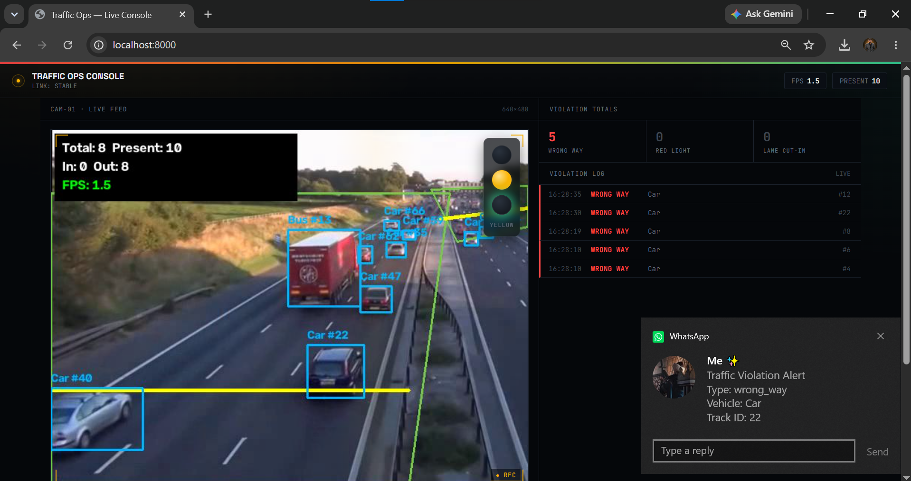

<div align="center">

# 🚦 Edge-AI Traffic Analytics Engine

### Vehicle Flow Counting · Traffic Intelligence · Violation Detection · Edge AI

**A working traffic-camera analytics engine that turns live video into actionable traffic intelligence.**

<p>
  <a href="https://github.com/mhamza2004/edge-ai-traffic-analytics">
    
  </a>
  
  
  
  
  
  
</p>

</div>

---

## 👀 See It in Action

<table>
<tr>
<td width="60%" align="center">

### 🖥️ Live Traffic Operations Console


**Real-time traffic monitoring dashboard**

Vehicle detections · Track IDs · Traffic counts · Lane activity · Violation totals · Live violation log

</td>
<td width="40%" align="center">

### 📱 Violation Alert



**Automated critical-incident notification**

Violation type · Vehicle · Track ID · Severity · Timestamp · Evidence

</td>
</tr>
</table>

---

## 🎯 What Is This?

This project is a **traffic-camera analytics engine** built to detect, track, count, analyze, and report vehicles from real traffic footage.

It combines computer vision with an operational monitoring layer:

```text
┌─────────────────────────────────────────────────────────────────┐
│                       TRAFFIC VIDEO / CAMERA                   │
└───────────────────────────────┬─────────────────────────────────┘
                                │
                                ▼
                    ┌───────────────────────┐
                    │   YOLOv8 Detection   │
                    └───────────┬───────────┘
                                ▼
                    ┌───────────────────────┐
                    │ ByteTrack Tracking   │
                    │      + Track IDs      │
                    └───────────┬───────────┘
                                ▼
              ┌─────────────────┼─────────────────┐
              │                 │                 │
              ▼                 ▼                 ▼
        Lane Analysis     Flow Counting    Speed Estimation
              │                 │                 │
              └─────────────────┼─────────────────┘
                                ▼
                    ┌───────────────────────┐
                    │ Violation Detection   │
                    │ Wrong-way / Red-light │
                    │     / Lane Cut-in     │
                    └───────────┬───────────┘
                                ▼
             ┌──────────────────┼──────────────────┐
             │                  │                  │
             ▼                  ▼                  ▼
        FastAPI API        Live Dashboard       MQTT
             │                  │                  │
             └──────────────────┼──────────────────┘
                                ▼
                    ┌───────────────────────┐
                    │ Evidence + Alerts    │
                    │ CSV + WhatsApp        │
                    └───────────────────────┘
```

The system is built to run on a **laptop/dev machine for testing** and provides deployment paths for **Raspberry Pi 4/5 (64-bit)** and **NVIDIA Jetson-class edge hardware**.

---

## ✨ Core Capabilities

| | Capability | What it does |
|---|---|---|
| 🚗 | **Vehicle Detection** | Detects cars, trucks, buses, and motorcycles using YOLOv8/COCO classes |
| 🎯 | **Multi-Object Tracking** | Maintains vehicle identities using Ultralytics ByteTrack |
| 🛣️ | **Multi-Lane Counting** | Counts directional inbound/outbound traffic with tripwire line crossing |
| ↔️ | **Direction Analysis** | Determines vehicle movement against configured lane directions |
| ⚡ | **Speed Estimation** | Estimates speed using calibrated distance/time measurements |
| 🚨 | **Wrong-Way Detection** | Detects vehicles travelling against the configured traffic direction |
| 🚦 | **Red-Light Detection** | Uses signal-state-driven logic to identify red-light violations |
| ↪️ | **Illegal Lane Cut-In** | Detects suspicious lane transitions |
| 📸 | **Evidence Capture** | Saves violation snapshots with timestamps and available speed data |
| 📡 | **MQTT Telemetry** | Publishes metrics, violations, and online/offline state |
| ⚙️ | **FastAPI Service** | REST, WebSocket, and MJPEG endpoints |
| 🖥️ | **Live Dashboard** | Browser-based operations console with no frontend build step |
| 📱 | **WhatsApp Alerts** | Evolution API integration for critical violation notifications |
| 📄 | **CSV Logging** | Logs traffic counts and violation events |
| 🎥 | **Annotated Video** | Generates annotated output videos |
| 🐳 | **Docker** | Docker resources for the engine and Mosquitto |
| 🤖 | **Edge Export** | NCNN / TFLite paths for edge inference and TensorRT path for Jetson |

---

## 🧪 Verification — What Was Actually Tested

This repository intentionally documents **real verification results and limitations** instead of presenting untested functionality as complete.

### ✅ Verified

- YOLOv8n vehicle detection
- ByteTrack multi-object tracking
- Multi-lane directional counting
- Wrong-way detection
- Red-light violation logic
- Illegal lane cut-in logic through dedicated unit tests
- Evidence snapshot generation
- Speed estimation
- MQTT telemetry with a local Mosquitto broker
- FastAPI health/metrics/violation endpoints
- WebSocket live feed
- MJPEG video feed
- Live Windows dashboard
- CSV count and violation logging
- Annotated output video
- Evolution API WhatsApp integration
- Real WhatsApp text + evidence-image delivery

### ⚠️ Hardware-Specific / Still Unverified

| Area | Status |
|---|---|
| Raspberry Pi **>25 FPS** target | Requires benchmarking on the actual Pi |
| Motorcycle footage | Detector supports the COCO motorcycle class, but the bundled motorway footage contains no motorcycles |
| Jetson TensorRT runtime/FPS | Export path exists; actual board verification requires a compatible Jetson |

> **Performance measured on the development machine must not be interpreted as Raspberry Pi or Jetson performance.**

---

## 📊 Validation Results

### Wrong-Way Detection

The normal traffic clip was scanned across:

```text
2,501 frames
0 false positives
```

A reversed real-footage test was also used to validate the wrong-way logic:

```text
22 / 41 vehicles flagged
```

### Speed Estimation

A 1,500-frame run produced:

```text
86 vehicles with completed readings
Observed values: approximately 18–60 km/h
```

The bundled `distance_m` value is **illustrative**, not a surveyed real-world measurement. A real camera installation must be calibrated using a measured distance.

### Edge Export — Development Machine

At 320px on the development CPU:

```text
NCNN       ≈ 49 FPS
TFLite int8 ≈ 110 FPS
```

Again, these are **not Raspberry Pi benchmark numbers**.

---

## 🚦 Why Three Separate Violation Demos?

A single ordinary traffic clip cannot realistically demonstrate every violation type.

The project therefore uses separate, explicitly documented validation methods:

| Violation | Demo / Validation | Why |
|---|---|---|
| **Wrong-way** | Real footage played in reverse | Produces genuine backward vehicle movement without drawing/fabricating vehicles |
| **Red-light** | Real footage + controlled signal window | Validates the signal-state-driven violation logic |
| **Illegal lane cut-in** | Dedicated unit tests | The bundled orderly footage does not naturally contain the required behavior |

Detailed reproduction notes and result counts are available in [`samples/README.md`](samples/README.md).

The goal is simple: **show exactly what was tested and how it was tested.**

---

## 🐛 Engineering Bugs Found & Fixed

### 1. Wrong-Way Lane Geometry

A perspective-related lane-geometry issue caused normal vehicles near the horizon to be evaluated against the wrong lane direction.

The observed false-positive rate went from:

```text
17%
 ↓
7.5%
```

The root cause was identified using trajectory tracing. Lane polygons were redrawn as perspective-correct trapezoids.

Final verification:

```text
0 false positives
2,501-frame clip
```

### 2. Lane Cut-In Geometry Drift

Perspective caused lane assignments to drift as vehicles moved into the distance.

The detector was changed so that smooth single-direction perspective drift is not automatically treated as a lane change.

Suspicious transitions are instead associated with:

- direction reversal
- jumps greater than one lane

Final full-clip verification:

```text
0 false positives
```

### 3. Tracking Non-Determinism

Repeated CPU runs occasionally produced different track IDs or ID swaps when vehicles crossed paths.

The pipeline mitigates implausible trajectory jumps using:

```text
max_step_displacement_px
```

This prevents unrealistic frame-to-frame movement from corrupting trajectory history.

---

## 🏗️ Architecture

### Application Layer

| Component | Responsibility |
|---|---|
| `app/detector.py` | YOLO detection + ByteTrack |
| `app/flow_counter.py` | Multi-lane directional counting |
| `app/geometry.py` | Polygon, line-crossing, and angle calculations |
| `app/violations.py` | Wrong-way, red-light, and lane cut-in logic |
| `app/speed_estimator.py` | Calibrated speed estimation |
| `app/pipeline.py` | Capture → detection → analytics → telemetry orchestration |
| `app/api/main.py` | FastAPI REST/WebSocket/MJPEG service |
| `app/dashboard/index.html` | Live operations dashboard |
| `app/telemetry/events.py` | Evidence snapshot generation |
| `app/telemetry/mqtt_publisher.py` | MQTT telemetry |
| `app/telemetry/whatsapp_alerts.py` | Evolution API WhatsApp alerts |

### Supporting Layer

| Directory | Purpose |
|---|---|
| `config/` | Camera, lane, counting, violation, and telemetry configuration |
| `data/` | Sample input footage |
| `docker/` | Engine + Mosquitto deployment resources |
| `docs/` | Project screenshots/documentation assets |
| `samples/` | Actual test outputs, CSVs, evidence, and demo documentation |
| `scripts/` | Pipeline runner, calibration, benchmarks, demos, model export |
| `tests/` | Geometry, lane cut-in, and speed-estimation tests |

---

## 🗂️ Repository Structure

```text
traffic-engine/
│
├── app/
│   ├── api/
│   ├── telemetry/
│   └── dashboard/
│
├── config/
├── data/sample_video/
├── docker/
├── docs/screenshots/
├── samples/
├── scripts/
├── tests/
│
├── .gitignore
├── evolution-docker-compose.yml
├── requirements.txt
├── requirements-rpi.txt
├── start_dashboard.bat
├── setup_autostart.bat
└── README.md
```

<details>
<summary><strong>🔍 Expand the complete project layout</strong></summary>

```text
app/
├── api/
│   ├── __init__.py
│   └── main.py
├── telemetry/
│   ├── __init__.py
│   ├── events.py
│   ├── mqtt_publisher.py
│   └── whatsapp_alerts.py
├── dashboard/
│   └── index.html
├── config.py
├── detector.py
├── flow_counter.py
├── geometry.py
├── pipeline.py
├── shared_state.py
├── signal_state.py
├── speed_estimator.py
└── violations.py

scripts/
├── run_pipeline.py
├── benchmark_fps.py
├── calibrate.py
├── demo_red_light_scenario.py
└── export_edge_model.py

tests/
├── test_geometry.py
├── test_lane_cutin.py
└── test_speed_estimator.py
```

</details>

---

## 🛠️ Technology Stack

<div align="center">

| Area | Technologies |
|---|---|
| **Language** | Python |
| **Computer Vision** | OpenCV |
| **Detection** | Ultralytics YOLOv8 |
| **Tracking** | ByteTrack |
| **API** | FastAPI |
| **Realtime** | WebSocket + MJPEG |
| **Telemetry** | MQTT / Mosquitto |
| **Alerts** | Evolution API + WhatsApp |
| **Data Services** | PostgreSQL + Redis |
| **Containers** | Docker / Docker Compose |
| **Edge Inference** | NCNN / TFLite / TensorRT |
| **Target Hardware** | Raspberry Pi 4/5, NVIDIA Jetson |

</div>

---

## 🚀 Quick Start — Desktop / Development

### 1. Clone the repository

```bash
git clone https://github.com/mhamza2004/edge-ai-traffic-analytics.git
cd edge-ai-traffic-analytics
```

### 2. Create a virtual environment

#### Windows PowerShell

```powershell
python -m venv venv
.\venv\Scripts\Activate.ps1
```

#### Linux / macOS

```bash
python3 -m venv venv
source venv/bin/activate
```

### 3. Install dependencies

```bash
pip install -r requirements.txt
```

### 4. Run a headless test

```bash
python -m scripts.run_pipeline --config config/config.yaml --max-frames 300
```

### 5. Start the live dashboard

```bash
python -m scripts.run_pipeline --serve --config config/config.yaml
```

Open:

```text
http://localhost:8000/
```

---

## 🎥 Use Your Own Camera / Video

Edit:

```text
config/config.yaml
```

Example:

```yaml
video:
  source: 0
```

Supported source types include:

- USB webcam index
- Raspberry Pi camera
- RTSP URL
- Local video file

### Calibrate the Scene

For a new camera angle, run:

```bash
python -m scripts.calibrate --source 0
```

Then configure the generated lane/line/zone coordinates inside:

```text
config/config.yaml
```

> Camera-specific calibration is required for reliable counting, lane analysis, and violation detection.

---

## 🍓 Raspberry Pi 4/5

Install the required packages:

```bash
sudo apt update
sudo apt install -y python3-opencv python3-picamera2 mosquitto mosquitto-clients
```

Install project dependencies:

```bash
pip install -r requirements-rpi.txt --break-system-packages
```

### Export to NCNN

```bash
python -m scripts.export_edge_model --format ncnn --imgsz 320
```

Configure:

```yaml
model:
  weights: "yolov8n_ncnn_model"

video:
  imgsz: 320
```

Benchmark the actual board:

```bash
python -m scripts.benchmark_fps \
  --weights yolov8n_ncnn_model \
  --imgsz 320 \
  --frames 200
```

Run:

```bash
python -m scripts.run_pipeline --serve --config config/config.yaml
```

---

## 🟩 Docker

The repository includes Docker resources for the engine and Mosquitto:

```bash
cd docker
docker compose up --build
```

The WhatsApp alert stack is provided separately:

```text
evolution-docker-compose.yml
```

---

## 🟢 NVIDIA Jetson

Jetson uses TensorRT for the optimized inference path.

> The TensorRT engine must be built on the target Jetson because the generated `.engine` file depends on the target GPU / TensorRT / CUDA environment.

Export on the Jetson:

```bash
python -m scripts.export_edge_model --format engine --imgsz 320 --half
```

Configure:

```yaml
model:
  weights: "yolov8n.engine"

video:
  imgsz: 320
```

Benchmark:

```bash
python -m scripts.benchmark_fps \
  --weights yolov8n.engine \
  --imgsz 320 \
  --frames 200
```

Run:

```bash
python -m scripts.run_pipeline --serve --config config/config.yaml
```

---

## 📡 MQTT Telemetry

MQTT is optional for a first run.

The engine can publish:

- traffic metrics
- violation events
- online/offline status

Example subscriber:

```bash
mosquitto_sub -h localhost -t 'traffic/intersection-1/#' -v
```

If no broker is available, the rest of the pipeline continues operating.

---

## 📱 WhatsApp Critical Alerts

The project integrates with a self-hosted:

```text
Evolution API
      +
PostgreSQL
      +
Redis
```

The integration was verified end-to-end with:

- a real WhatsApp number
- QR-based device linking
- text violation alerts
- evidence-image alerts
- a live pipeline run

### Start the stack

```powershell
docker compose -f evolution-docker-compose.yml up -d
```

Check:

```powershell
docker ps
```

Open:

```text
http://localhost:8080/manager
```

### Example configuration

```yaml
telemetry:
  whatsapp:
    enabled: true
    evolution_api_url: "http://localhost:8080"
    evolution_api_key: "YOUR_SECRET"
    instance: "traffic-alerts"
    to_number: "923XXXXXXXXX"
    alert_on:
      - "wrong_way"
      - "red_light"
      - "illegal_lane_change"
    min_seconds_between_alerts: 15
```

### 🔐 Security

Demo credentials must be replaced before real deployment.

**Never commit production credentials, API keys, passwords, or private recipient information to Git.**

The shipped configuration keeps WhatsApp disabled by default.

---

## 🖥️ Windows Auto-Start

### `start_dashboard.bat`

Activates the virtual environment and starts the live dashboard server.

### `setup_autostart.bat`

Registers the dashboard with Windows Task Scheduler.

Run once as Administrator.

Remove the scheduled task with:

```powershell
schtasks /Delete /TN "TrafficAnalyticsEngine" /F
```

---

## 📊 Sample Outputs

The `samples/` directory contains outputs from actual runs:

```text
samples/
├── 1_main_pipeline_output.mp4
├── 1_main_pipeline_stats.csv
├── 2_wrongway_demo_output.mp4
├── 2_wrongway_demo_stats.csv
├── 3_redlight_demo_output.mp4
├── redlight_evidence/
├── wrongway_evidence/
└── README.md
```

These files document the main pipeline and dedicated violation demonstrations.

---

## ⚙️ Tuning Violation Sensitivity

Violation thresholds live in:

```text
config/config.yaml
```

Examples:

```text
angle_threshold_deg
confirm_frames
max_switches_allowed
window_seconds
```

When moving to a new camera, calibration and threshold tuning are expected deployment steps.

---

## 🔐 Repository & Data Handling

The repository intentionally excludes unnecessary generated/model assets such as:

```text
__pycache__/
*.pyc
*.pt
*.onnx
*_ncnn_model/
*_saved_model/
venv/
.venv/
outputs/*
evidence/*
```

Selected demonstration videos and sample outputs are included because they are part of the documented testing workflow.

---

## 📚 Reference Repositories

The implementation research drew on:

- **Qengineering** — `Traffic-Counter-RPi_64-bit`
- **sopheakchan** — `realtime-vehicle-detection`
- **Prince-IISc-CalUniv** — `Edge-AI-Traffic-Analytics`

These references informed patterns around traffic counting, MQTT, tracking, geometry, violation/congestion analysis, and edge deployment.

The project's specific wrong-way, red-light, and illegal lane cut-in logic was designed for this implementation rather than copied verbatim from those repositories.

---

## 🗺️ Roadmap

- [ ] Additional traffic violation types
- [ ] License plate recognition
- [ ] Automatic number plate extraction
- [ ] Traffic-density analytics
- [ ] Historical traffic reporting
- [ ] Multi-camera management
- [ ] Improved camera calibration workflow
- [ ] Edge-device performance benchmarking
- [ ] Real-time alert escalation
- [ ] Centralized traffic intelligence dashboard
- [ ] Database-backed incident history

---

## 👨‍💻 Author

<div align="center">

### Muhammad Hamza

**Software Engineering Student · AI Automation · Backend Development · Computer Vision**

<a href="https://github.com/mhamza2004">
  
</a>
<a href="https://www.linkedin.com/in/muhammadhamza3304">
  
</a>

</div>

---

<div align="center">

### ⭐ Edge-AI Traffic Analytics Engine

**Built, tested, debugged, and documented as a practical traffic-intelligence system.**

If you find the project useful, consider giving the repository a ⭐.

</div>
